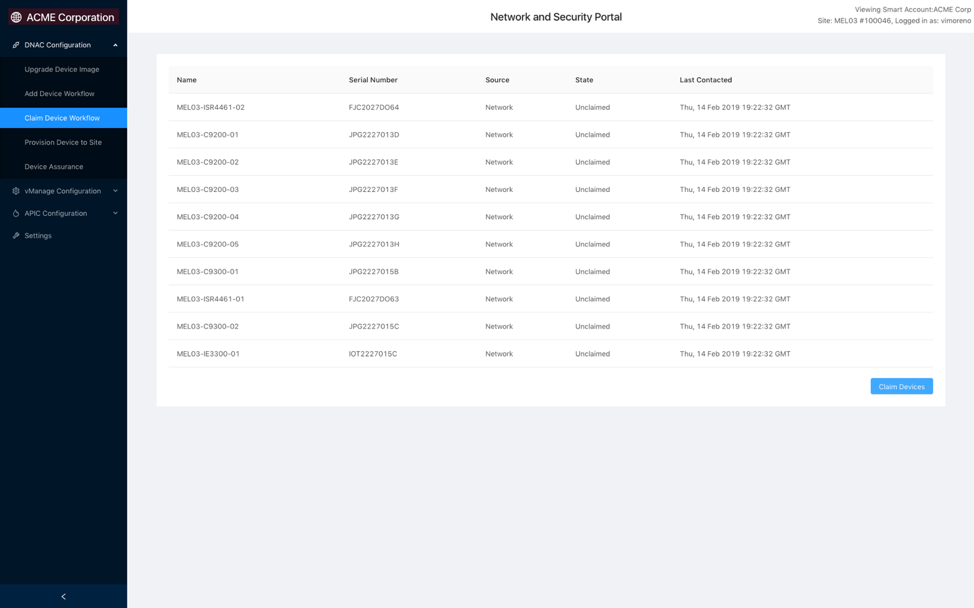
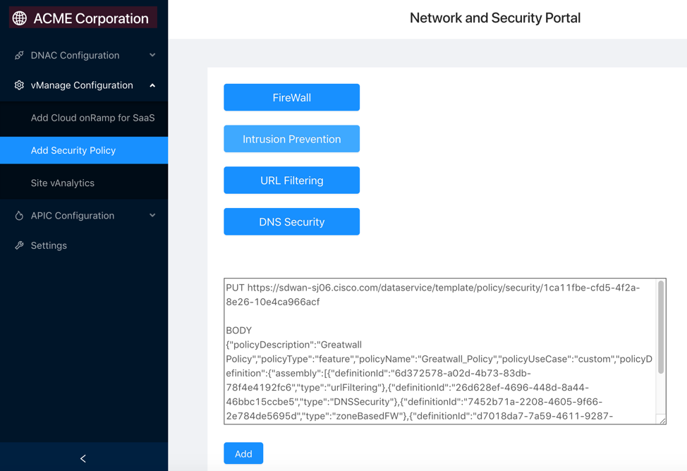

# Introduction

Try the APIs from the Cisco Live Melbourne Technology Keynote. The demonstration at the keynote shows how one can create a Portal to automate common management controller tasks, to streamline operations across multiple management controllers.  This is done by leveraging the management controller’s Representational State Transfer (REST) APIs.  This demo leverages these REST API’s to configure devices in the Campus as well as in the Branch environment (across a WAN connection to the Campus).

REST is an architecture style for designing networked applications. REST uses Hypertext Transfer Protocol (HTTP or HTTPS) to send a request to a web service, which returns a response. The standard HTTP methods are GET (retrieve information), PUT (update an object), POST (create an object) and DELETE (remove an object). Learn more details on API or REST at [learning labs](https://learninglabs.cisco.com)

This Github repository provides the necessary REST API calls to Cisco DNAC for claiming devices to a pre-defined workflow in DNAC and assigning a Border node to an existing Fabric.  This repository also provides REST API calls to Cisco vManage to configure an Intrusion Prevention System policy. 


# Cisco DNAC and vManage Introduction

Cisco DNAC is a Campus network management controller used to manage, monitor and secure a campus environment.  DNAC secures campus environments by implementing a fabric(s), segment users within that fabric and implements group based-policies.  This part of the solution is called SD-Access.  Cisco DNAC can also be used to manage (push device configuration, upgrade device images) and monitor (through Assurance) both fabric and non-fabric environments.  Assurance monitors device, endpoint/client and application health.  

Cisco vManage is a WAN management controller that is used to provide a cloud-first architecture that separates data and control planes.  Cisco vManage is a fabric allows to securely and easily connect your WAN to data centers, branches, campuses, and colocation facilities to improve network speed, security, and efficiency.  This WAN fabric is called SD-WAN.

The Cisco SD-WAN fabric and solution connects users at the branch to applications in the cloud in a seamless, secure, and reliable fashion. Cisco vManage is used to manage and monitor the branch devices.  

Cisco SD-WAN reduces complexity by having a single management interface (vManage) for both the network and security. Cisco SD-WAN Security capabilities include an application-aware enterprise firewall, Intrusion Prevention Security (IPS), DNS layer enforcement (Cisco Umbrella™), and URL filtering. 

# Cisco DNAC and vManage REST APIs

Both Cisco vManage controller and Cisco DNAC are open and programmable. With this open and programmability, you can access the available REST APIs, create API calls, obtain device and interface information using code, pass parameters and write applications and work on innovative solutions. 

Learn more details at [vManage REST APIs documentation](https://developer.cisco.com/sdwan/) and [DNA Center Platform documentation](https://developer.cisco.com/site/dna-center-rest-api/) 


# Installation of WebPortal to execute REST APIs to DNAC/vManage

On Ubuntu 18.04 VM with Python 2.7 Install the following packages

```
sudo apt-get install -y nodejs
sudo apt-get install -y npm
sudo npm install -g pm2
sudo npm install -g http-server
sudo apt-get install unzip
sudo apt-get install python-pip
```

Get the code from https://github.com/CiscoDevNet/automation-dashboard and then go to WebPortal directory.

Verify that path is “/usr/local/bin/http-server” and then execute the following command, if not change path after “pm2 start <http-server path> -- <where the build folder is located>” and start the UI server.

```“pm2 start /usr/local/bin/http-server -- /home/…./WebPortal/build --p 7000”```

Execute the command “pm2 startup”

Copy the line “sudo env PATH=…” from the above output and then execute.

```sudo env PATH=$PATH:/usr/bin /us/local/lib/node_modules/pm2/bin/pm2 startup system -u user --hp /home/user```

Install python related packages using the following commands

```
sudo pip install flask
sudo pip install requests
sudo pip install flask_cors
```
After installing the packages, go to the application path 

```cd /home/……/WebPortal/```

Then execute the following command

```nohup python app.py &```

Go to the browser and enter `https://<server_ip>:7000` for accessing the WebPortal.

# API Operations

## DNAC Usecase 1- PnP Operations
In the first use case, PnP is used to “claim” devices to a pre-defined workflow.  This process is used for day zero bootstrap configuration.  This workflow can be tailored to site, certain features, devices, etc.

There are many PnP API’s.  There are some examples below that were performed prior to this demo.  These can be done via the API, manually or a process of automated DNAC steps. 


|  API  |  Operation  | Description  |
|  ---  |  ---  |   ---  | 
|  [/dna/intent/api/v1/onboarding/pnp-settings/savacct ](/dna/intent/api/v1/onboarding/pnp-settings/savacct )  |  POST | Add Virtual Account |
|  [/dna/intent/api/v1/onboarding/pnp-workflow](/dna/intent/api/v1/onboarding/pnp-workflow )  |  POST  | Add a Workflow |
|  [/dna/intent/api/v1/onboarding/pnp-device](/dna/intent/api/v1/onboarding/pnp-device)  |  POST  | Add a Device |
|  [/dna/intent/api/v1/template-programmer/project](/dna/intent/api/v1/template-programmer/project)  |  POST  | Create Project |
|  [/dna/system/api/v1/site](/dna/system/api/v1/site)  |  POST  | Create Site |

The next PnP API is the one that was performed in this demo.  
Claim devices to a site (that has a pre-defined workflow):


```
POST https://<DNAC hostname/IP>/dna/intent/api/v1/onboarding/pnp-device/site-claim

BODY
Model:

{
  "deviceId": "string",
  "siteId": "string",
  "type": "Default"
}

Demo Example:
{  "deviceId": "<Device name>",  "siteId": ”MEL03",  "type": ”BorderRouter"}
{  "deviceId": "MEL03-C9200-01",  "siteId": ”MEL03",  "type": ”Access"}
{  "deviceId": "MEL03-C9200-02",  "siteId": ”MEL03",  "type": ”Access"}
{  "deviceId": "MEL03-C9200-03",  "siteId": ”MEL03",  "type": ”Access"}
{  "deviceId": "MEL03-C9300-01",  "siteId": ”MEL03",  "type": ”Access"}
{  "deviceId": "MEL03-C9800-05",  "siteId": ”MEL03",  "type": ”Access"}
{  "deviceId": "MEL03-C9500-01",  "siteId": ”MEL03",  "type": ”Core"}
{  "deviceId": "MEL03-ISR4461-01",  "siteId": ”MEL03",  "type": ”BorderRouter"}
{  "deviceId": "MEL03-C9500-01",  "siteId": ”MEL03",  "type": ”Core"}
{  "deviceId": "MEL03-IE3300-01",  "siteId": ”MEL03",  "type": ”Access"}
```


## DNAC UseCase 2 - Add Fabric Border to existing Fabric
Once a fabric is created, we have the ability to add fabric borders that will connect to our Datacenter(s), WAN, Branch and other environments.  In the second use case, we are adding recenty claimed and provisioned devices to an existing fabric.

NOTE: Base provisioning is necessary post PnP and before devices can be added to the Fabric.  This was not performed in this demo.  Additionally, API’s for adding Fabric Edge, WLC and Control Plane Node roles are not yet available in DNAC version 1.2.10.

```
POST  https://<DNAC IP/Hostname>/dna/intent/api/v1/business/sda/border-device/

BODY

Model:

[
  {
    "deviceManagementIpAddress": "string",
    "siteHierarchy": "string",
    "externalDomainRoutingProtocolName": "string",
    "externalConnectivityIpPoolName": "string",
    "internalAutonomouSystemNumber": "string",
    "borderSessionType": "string",
    "connectedToInternet": true,
    "externalConnectivitySettings": [
      {
        "interfaceName": "string",
        "externalAutonomouSystemNumber": "string",
        "l3Handoff": [
          {
            "virtualNetwork": {
              "virtualNetworkName": "string"
            }
          }
        ]
      }
    ]
  }
]
```

Demo Example:

```
[  {    "deviceManagementIpAddress": "10.0.255.34",    ”siteHierarchy”: Australia,Victoria,Melbourne,MEL03”,"externalDomainRoutingProtocolName": ”BGP", "internalAutonomouSystemNumber":”BGPUplink”, "internalAutonomouSystemNumber": ”65000”,"borderSessionType": ”Anywhere",   "connectedToInternet": true,    "externalConnectivitySettings": [      {        "interfaceName": ”Interface TenGigabitEthernet1/0/12",        "externalAutonomouSystemNumber": ”65001",        "l3Handoff": [          {            "virtualNetwork": {              "virtualNetworkName": ”Campus"            }          }        ]      }    ]  }]
```


## vManage Use Case 1- Add Intrusion Prevention System Policy:
In this demo, we are adding an IPS policy to an existing Security policy.  The following REST API will add an IPS policy to the existing SD-WAN security policy called “Greatwall_Policy” using the HTML web portal that you built.

```
PUT https://<vManage hostname/IP>/dataservice/template/policy/security/1ca11fbe-cfd5-4f2a-8e26-10e4ca966acf

BODY

Demo Example:
{"policyDescription":"Greatwall Policy","policyType":"feature","policyName":"Greatwall_Policy","policyUseCase":"custom","policyDefinition":{"assembly":[{"definitionId":"6d372578-a02d-4b73-83db-78f4e4192fc6","type":"urlFiltering"},{"definitionId":"26d628ef-4696-448d-8a44-46bbc15ccbe5","type":"DNSSecurity"},{"definitionId":"7452b71a-2208-4605-9f66-2e784de5695d","type":"zoneBasedFW"},{"definitionId":"d7018da7-7a59-4611-9287-6f3716a3a447","type":"intrusionPrevention"}],"settings":{"failureMode":"close","zoneToNozoneInternet":"deny"}}}
```



# Get the code

Clone the repository with the following command:

git clone https://github.com/CiscoDevNet/automation-dashboard.git


# Requirements
Use pip to install the necessary requirements.
```sudo pip install -r requirements.txt```


